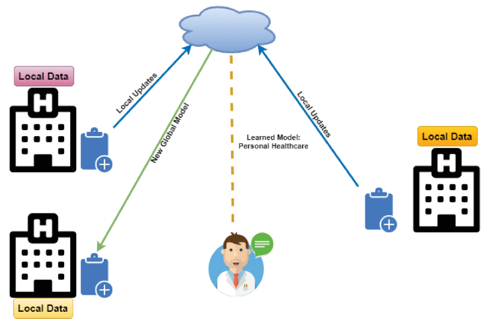
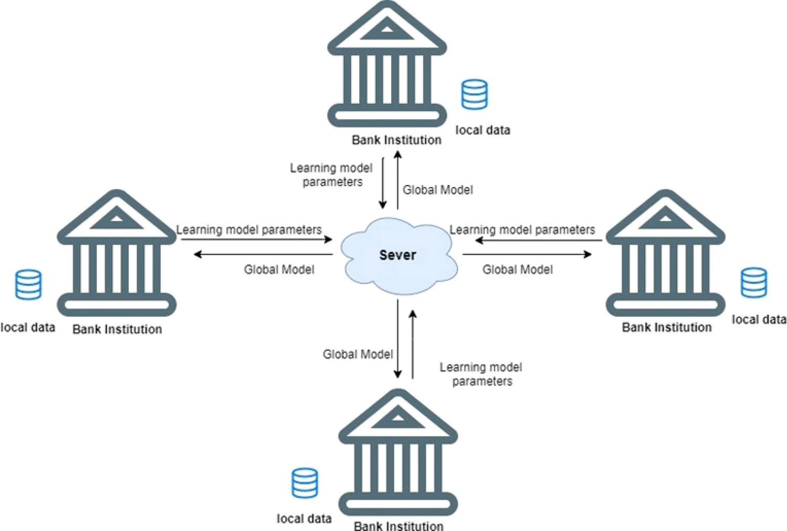
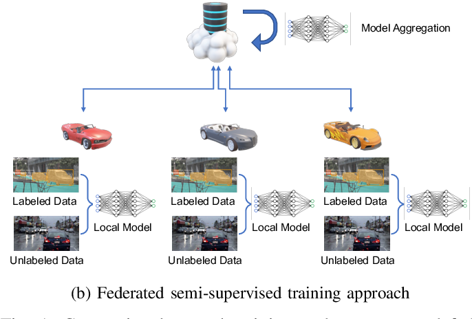
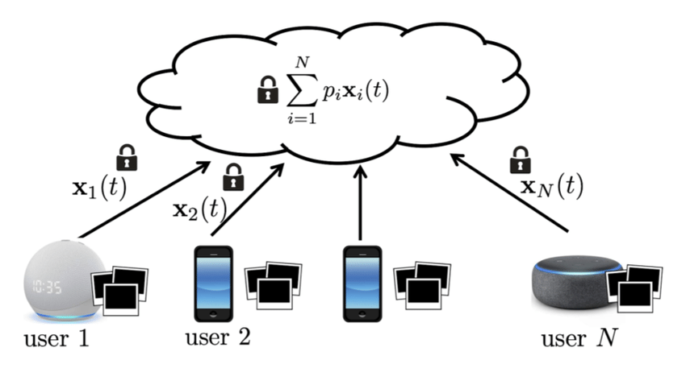
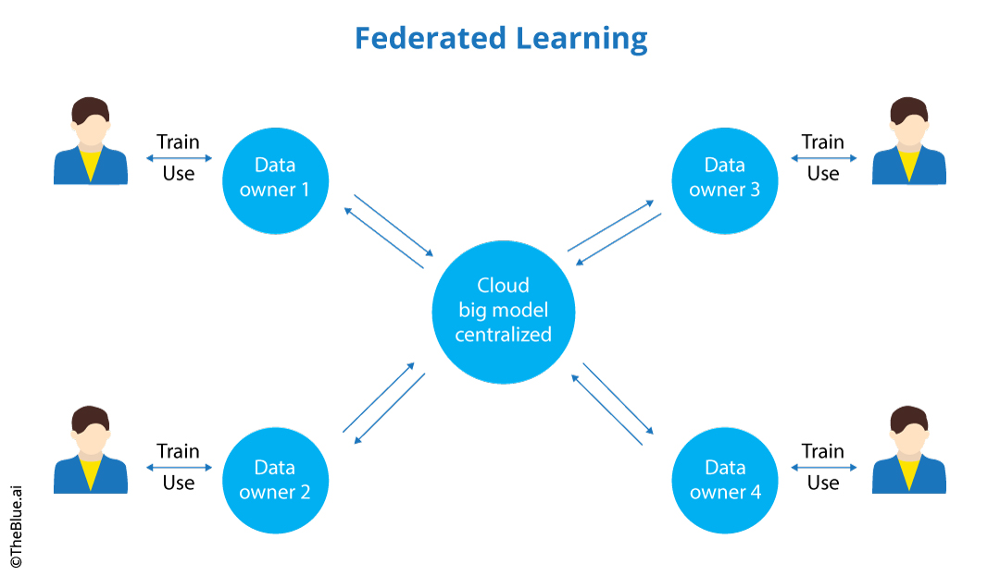
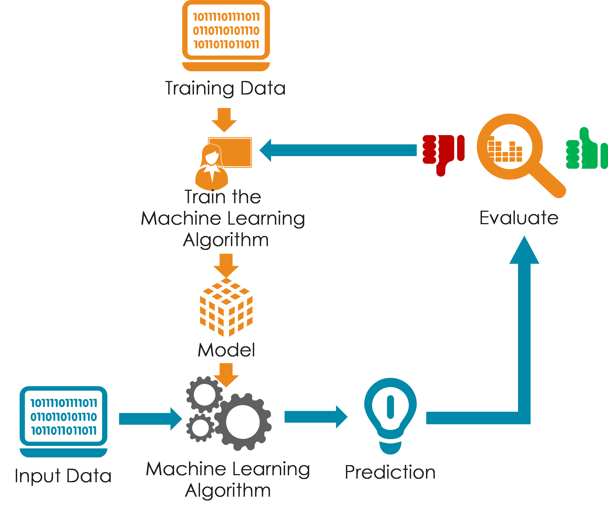
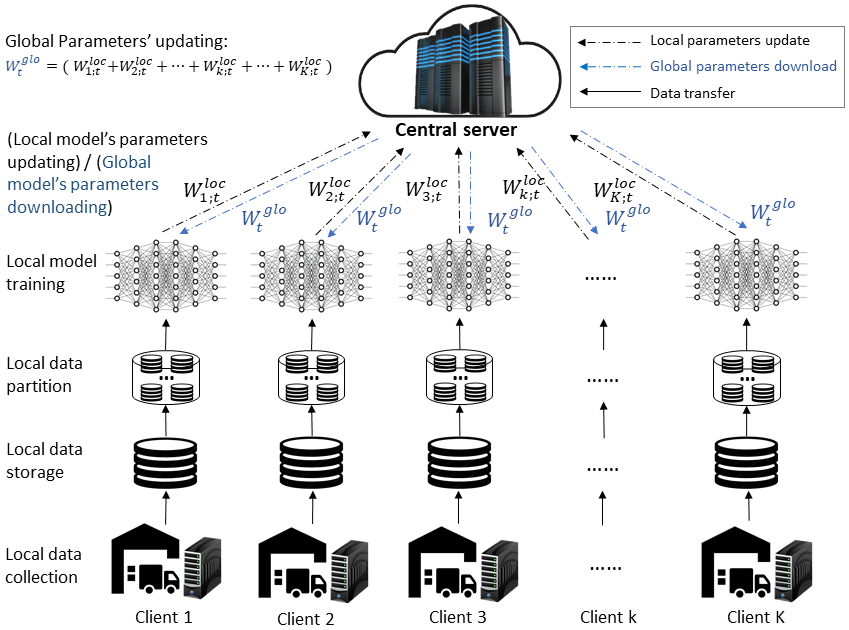

# Module 1 — Federated Learning Foundations

## Overview

**Teaching:** 15–30 min
**Exercises:** 10–20 min
**Notebook:** `1_FL_Intro/FL_intro.ipynb`

This module introduces federated learning as a way to train a shared model across distributed clients while keeping raw data local. The goal is to understand why federated learning exists, how the basic client-server workflow operates, and what tradeoffs appear when model training is distributed.

---

## Learning objectives

By the end of this module, students should be able to:

1. Explain why centralized machine learning can be difficult or inappropriate for some datasets.
2. Define federated learning in terms of clients, server, local training, model updates, and aggregation.
3. Compare centralized machine learning with federated learning.
4. Describe the basic federated learning communication round.
5. Identify real-world settings where federated learning is useful.
6. Explain why federated learning reduces raw data movement but does not automatically solve all privacy or security problems.

---

## Guiding questions

Use these questions to frame the module:

1. Why might we avoid collecting all training data in one central location?
2. What is a client in federated learning?
3. What does the server send to clients?
4. What do clients send back to the server?
5. What is a communication round?
6. What problems does federated learning help address?
7. What problems still remain after using federated learning?

---

## Why federated learning?

Many useful datasets are distributed across devices, users, companies, hospitals, vehicles, or sensors. In classical machine learning, the usual approach is to collect data in one place and train a model centrally. That is not always realistic.

Centralizing data can be difficult because of:

* **Privacy concerns:** users or institutions may not want raw data copied elsewhere. [2]
* **Regulatory limits:** medical, financial, educational, and personal data may be restricted by law or policy. Laws such as GDPR [7] and HIPAA [9] restrict how data can be collected, transferred, or pooled.
* **Data ownership:** organizations may not be allowed or willing to share proprietary data. [2]
* **Bandwidth and storage costs:** moving large datasets can be expensive or impractical. [1][2]
* **Security risk:** centralizing sensitive data creates a high-value target. [2]
* **Distributed environments:** data may be generated continuously on phones, sensors, vehicles, or edge devices. [2]

Federated learning addresses this by changing the training workflow:

> Instead of moving data to the computation, federated learning moves computation to the data.

Raw data stays with each client. The server coordinates training by sending models to clients and aggregating the updates returned by those clients.

---

## Relatable examples

### Keyboard autocomplete

A phone can improve typing suggestions using local typing behavior. However, users may not want raw text messages or typing history sent to a central server. [5]

In this case:

* the **client** is the phone,
* the **local data** is typing behavior,
* the **server** coordinates training,
* and only model updates are shared.

### Hospitals

Hospitals may want to collaborate on a medical imaging model, but patient data is sensitive and regulated. Federated learning allows hospitals to train a shared model without pooling raw patient records or images. [4]

This is an example of **cross-silo federated learning**, where each client is an organization.

<center>
<br>
Figure from: https://www.linkedin.com/pulse/federated-learning-healthcare-part-1-saber-ghadakzadeh-md-msc-phd/
</center>

### Banks and fraud detection

Banks may each observe different fraud patterns, but customer transaction data cannot always be freely shared. Federated learning can allow institutions to collaborate while keeping raw customer data local. [6]

<center>
<br>
Figure from: https://link.springer.com/article/10.1007/s00521-023-09410-2/figures/2
</center>

### Autonomous vehicles and IoT

Vehicles and sensors generate large amounts of local data. Sending all raw data to a central server may be too expensive, too slow, or too sensitive. Federated learning can reduce data movement by sending model updates instead of raw sensor streams. [2][5]

<center>
<br>
Figure from: https://www.semanticscholar.org/paper/Federated-Semi-Supervised-Learning-for-Object-in-Chi-Wang/569aafb945854b09ba3a47fc6376d83cced03597
</center>

<center>
<br>
Figure from: https://www.researchgate.net/publication/356249953/figure/fig1/AS:1092587159076864@1637504486141/Federated-Learning-for-IoT-Devices.ppm
</center>

---

## What is federated learning?

Federated learning is a machine learning approach where multiple clients collaboratively train a shared model while keeping their raw data local. [1][2]

<center>
<br>
Figure from: https://www.linkedin.com/pulse/federated-learning-healthcare-part-1-saber-ghadakzadeh-md-msc-phd/
</center>

A typical federated learning system has:

* a **server**, which coordinates training,
* multiple **clients**, which hold local data,
* a **global model**, which is shared across the federation,
* **local training**, where clients update the model using their own data,
* and **aggregation**, where the server combines client updates.

The central idea is:

| Classical machine learning    | Federated learning                           |
| ----------------------------- | -------------------------------------------- |
| Move data to a central server | Keep data local                              |
| Train on pooled data          | Train across distributed clients             |
| Central server sees raw data  | Server receives model updates                |
| Simpler training setup        | More communication and coordination required |

---

## Who or what is a client?

A **client** is any participant that holds local data and can perform local training. [2]

Examples of clients include:

* phones,
* hospitals,
* banks,
* companies,
* autonomous vehicles,
* IoT devices,
* research labs,
* edge servers.

There are two common federated learning settings:

### Cross-device federated learning

Cross-device FL involves many small clients, such as phones, wearables, or IoT devices.

Typical properties:

* many clients,
* limited compute per client,
* unreliable availability,
* small local datasets,
* privacy-sensitive user data.

### Cross-silo federated learning

Cross-silo FL involves a smaller number of larger clients, such as hospitals, banks, companies, or institutions.

Typical properties:

* fewer clients,
* more reliable compute,
* larger local datasets,
* organizational or regulatory data boundaries.

---

## Classical machine learning vs federated learning

### Classical centralized machine learning

In centralized machine learning, data from multiple sources is collected in one location.

<center>
<br>
Figure from: https://7wdata.be/big-data/building-the-machine-learning-infrastructure/
</center>

Typical workflow:

1. Collect data from users, devices, or organizations.
2. Store the data on a central server.
3. Train a model on the pooled dataset.
4. Deploy the model.

This approach is simple and effective when data can be centralized. However, it may not be appropriate when data is sensitive, distributed, expensive to move, or legally restricted.

### Federated learning

In federated learning, the data remains local.

<center>
<br>
Figure from: https://www.researchgate.net/figure/The-framework-of-Federated-Learning-Graphical-illustration-of-the-working-principle-of_fig1_367191647
</center>

Typical workflow:

1. The server initializes a global model.
2. The server sends the model to selected clients.
3. Each client trains the model on local data.
4. Clients send model updates back to the server.
5. The server aggregates the updates.
6. The updated global model is sent out again.
7. The process repeats.

Federated learning allows collaboration without directly pooling raw data.

---

## The federated learning process

A basic federated learning round follows this loop:

```text
Initialize global model
        ↓
Send model to clients
        ↓
Clients train locally
        ↓
Clients send updates
        ↓
Server aggregates updates
        ↓
Updated global model
        ↺ repeat
```

### Step 0: Initialize the global model

The server begins with a global model. This model may be randomly initialized or loaded from a checkpoint.

### Step 1: Send the model to clients

The server selects some clients and sends them the current global model.

Not every client needs to participate in every round. In large systems, only a subset of clients may be available or selected. [2]

### Step 2: Local training

Each client trains the model using only its own local data.

For example, one hospital trains on its own patient data, while another hospital trains on its own patient data. The raw data stays inside each hospital.

### Step 3: Return model updates

After local training, clients send updates back to the server. These updates may be model weights, gradients, or parameter differences, depending on the implementation.

The important point is:

> Clients send model information, not raw training samples.

### Step 4: Aggregate updates

The server combines the client updates to produce a new global model.

The simplest and most common baseline method is **Federated Averaging**, or **FedAvg**. In FedAvg, the server averages client model updates, often weighting each client by the amount of data it used for local training. [1]

### Step 5: Repeat across communication rounds

One full cycle of sending the model, local training, returning updates, and aggregating is called a **communication round**.

Federated learning usually requires many communication rounds before the global model reaches useful performance.

---

## FedAvg at a high level

FedAvg is the first aggregation method students should understand. [1]

The basic idea:

1. The server sends the current model to clients.
2. Clients train locally.
3. Clients return updated model parameters.
4. The server averages those updates.
5. The average becomes the next global model.

FedAvg is a useful baseline because it is simple, but it can struggle when clients have very different data distributions. That issue motivates Module 2.

---

## Benefits of federated learning

Federated learning can help with:

### Reduced raw data movement

Raw data stays local, so less sensitive data is copied across networks or stored centrally. [2]

### Privacy-aware collaboration

Organizations can collaborate on model training without directly sharing their raw datasets. [2][3]

### Lower bandwidth pressure

In some settings, sending model updates may be more practical than sending large raw datasets. [1][2]

### Data ownership and sovereignty

Clients maintain control over their local data. [2]

### Edge and device learning

Models can improve from data generated on phones, sensors, vehicles, and other edge devices. [2]

---

## Challenges and limitations

Federated learning is useful, but it is not a perfect solution.

### Communication cost

Federated learning may require many rounds of communication between clients and the server. [1][2]

### Non-IID data

Clients often have different data distributions. For example, one hospital may see different patient populations than another hospital, or one phone user may type differently from another user.

This can make training slower, less stable, or less accurate. [2]

### Systems heterogeneity

Clients may have different hardware, network speeds, availability, and battery limits. [2]

### Privacy leakage

Raw data is not shared, but model updates can still leak information in some settings. [13][14]

### Security threats

Federated learning can be attacked. Malicious clients may send harmful updates, poison the global model, or attempt to insert backdoors. [15]

### Harder debugging

Distributed training can be more difficult to monitor, reproduce, and debug than centralized training.

---

## Security and trust in federated learning

Federated learning reduces the need to centralize raw data, but it does **not** automatically guarantee privacy, security, or trust. [2]

Three important concerns are:

1. **Privacy:** Can someone infer sensitive information from model updates? [13][14]
2. **Integrity:** Can a malicious client manipulate the global model? [15]
3. **System trust:** Can we trust the clients, server, software, and training process?

Common protection methods include:

* **secure aggregation** — the server learns only an aggregate of client updates, not individual contributions, [3]
* **differential privacy** — calibrated noise bounds the influence of any single user's data, [16]
* update clipping,
* anomaly detection,
* robust aggregation, [2]
* client monitoring,
* and defense against poisoning or backdoor attacks. [15]

These topics are introduced here at a high level and revisited in later modules.

---

## Relation to the notebook

In `FL_intro.ipynb`, students will see a simplified federated learning workflow.

Students should focus on:

1. identifying the server and clients,
2. understanding what data stays local,
3. following the local training step,
4. observing how updates are aggregated,
5. tracking global model performance across rounds.

The goal is not to optimize performance yet. The goal is to understand the basic FL loop.

---

## Suggested experiments

Try at least one of the following:

### Experiment 1: Change the number of clients

Increase or decrease the number of clients and observe whether the training behavior changes.

Discussion questions:

* Does adding more clients make training better, worse, or just different?
* What might happen if each client has less data?

### Experiment 2: Change the number of communication rounds

Run the model for fewer or more rounds.

Discussion questions:

* Does accuracy improve steadily?
* Does the model appear to converge?
* How many rounds seem necessary?

### Experiment 3: Change local epochs

Increase the amount of local training each client performs before sending updates back.

Discussion questions:

* Does more local training help?
* Could too much local training cause problems?
* Why might this matter when client data is different?

### Experiment 4: Compare centralized and federated intuition

Discuss how the workflow would differ if all data were centralized.

Discussion questions:

* What becomes easier in centralized ML?
* What risks or constraints return when data is centralized?
* Why might FL still be worth the extra complexity?

---

## Checkpoint questions

After completing the module, students should be able to answer:

1. What problem is federated learning trying to solve?
2. What is the difference between centralized ML and federated learning?
3. What is a client?
4. What is the role of the server?
5. What does the server send to clients?
6. What do clients send back?
7. What is FedAvg?
8. What is one communication round?
9. Why does federated learning not automatically guarantee privacy?
10. What problem does Module 2 investigate?

---

## Quick self-assessment

Answer in 3–5 sentences:

> Explain federated learning to someone who knows basic machine learning but has never heard of FL. Include why FL is useful and what moves between clients and the server.

A strong answer should mention:

* raw data stays local,
* clients train locally,
* the server coordinates training,
* model updates are shared,
* aggregation produces a new global model,
* and FL is useful when data is distributed, sensitive, regulated, expensive to move, or owned by different parties.

---

## Transition to Module 2

Module 1 introduces the basic federated learning loop.

Module 2 asks what happens when clients do **not** have similar data.

In real federated learning systems, client data is often **non-IID**, meaning each client may have a different distribution of labels, features, behaviors, or environments. This can make training slower, unstable, or less accurate.

Module 2 explores this problem through data heterogeneity and Dirichlet partitioning.

---

## References

[1] McMahan et al. *Communication-Efficient Learning of Deep Networks from Decentralized Data* (AISTATS 2017). https://proceedings.mlr.press/v54/mcmahan17a.html

[2] Kairouz et al. *Advances and Open Problems in Federated Learning* (arXiv:1912.04977). https://arxiv.org/abs/1912.04977

[3] Bonawitz et al. *Practical Secure Aggregation for Privacy-Preserving Machine Learning* (CCS 2017). https://eprint.iacr.org/2017/281

[4] Rieke et al. *The future of digital health with federated learning* (npj Digital Medicine, 2020). https://doi.org/10.1038/s41746-020-00323-1

[5] Hard et al. *Federated Learning for Mobile Keyboard Prediction* (arXiv:1811.03604). https://arxiv.org/abs/1811.03604

[6] Zheng et al. *Federated Meta-Learning for Fraudulent Credit Card Detection* (IJCAI 2020). https://doi.org/10.24963/ijcai.2020/642

[7] GDPR (EUR-Lex). *Regulation (EU) 2016/679* — Article 44 "General principle for transfers". https://eur-lex.europa.eu/eli/reg/2016/679/oj/eng

[8] California DOJ. *California Consumer Privacy Act (CCPA)* overview. https://oag.ca.gov/privacy/ccpa

[9] U.S. HHS. *The HIPAA Privacy Rule* overview. https://www.hhs.gov/hipaa/for-professionals/privacy/index.html

[10] U.S. FTC. *How to Comply with the Privacy of Consumer Financial Information Rule (GLBA)*. https://www.ftc.gov/tips-advice/business-center/guidance/how-comply-privacy-consumer-financial-information-rule-gramm

[11] Pew Research Center. *Americans and Privacy: Concerned, Confused and Feeling Lack of Control Over Their Personal Information* (2019). https://www.pewresearch.org/internet/2019/11/15/americans-and-privacy-concerned-confused-and-feeling-lack-of-control-over-their-personal-information/

[12] IETF Internet-Draft. *Definition of End-to-end Encryption* (draft-knodel-e2ee-definition). https://datatracker.ietf.org/doc/html/draft-knodel-e2ee-definition-11

[13] Shokri et al. *Membership Inference Attacks Against Machine Learning Models* (IEEE S&P 2017). https://doi.org/10.1109/SP.2017.41

[14] Fredrikson et al. *Model Inversion Attacks that Exploit Confidence Information and Basic Countermeasures* (CCS 2015). https://doi.org/10.1145/2810103.2813677

[15] Bagdasaryan et al. *How To Backdoor Federated Learning* (AISTATS 2020). https://proceedings.mlr.press/v108/bagdasaryan20a.html

[16] Dwork and Roth. *The Algorithmic Foundations of Differential Privacy* (2014). https://www.microsoft.com/en-us/research/publication/algorithmic-foundations-differential-privacy/
