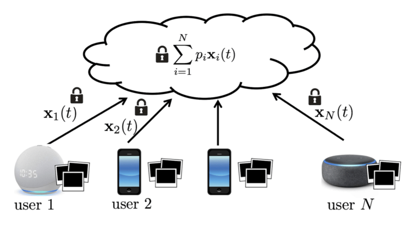

# Introduction to Federated Learning

## Overview

**Teaching:** 15 min  
**Exercises:** 0 min

**Questions**
- What is Federated Learning?
- How does Federated Learning differ from classical machine learning?
- What are the key challenges that Federated Learning addresses?
- How does the Federated Learning process work?

**Objectives**
- Understanding the fundamental concepts of Federated Learning
- Recognizing the limitations of classical centralized machine learning
- Comprehending the five-step Federated Learning process
- Identifying real-world applications and use cases
## What is Federated Learning?

Federated Learning is a machine learning approach that enables model training across multiple decentralized devices or servers holding local data samples, without exchanging the data samples themselves. This paradigm represents a fundamental shift from traditional centralized machine learning approaches.

 
Figure from: https://www.linkedin.com/pulse/federated-learning-healthcare-part-1-saber-ghadakzadeh-md-msc-phd/

 

### Who/what is a “client” in FL?

A **client** is any participant that holds data locally and can compute updates:
- **Cross-device FL:** millions of phones / IoT devices (each device is a client)
- **Cross-silo FL:** a small number of **organizations/corporations** (e.g., hospitals, banks, companies, data centers) where each institution is a client

### Key Principle

The core principle of Federated Learning can be summarized in one line:
- **Classical Machine Learning:** Move the data to the computation
- **Federated Learning:** Move the computation to the data

This approach enables machine learning in scenarios where data cannot be centralized due to privacy concerns, regulatory requirements, or practical constraints.

## Classical Machine Learning vs. Federated Learning

### Classical Machine Learning

In classical machine learning, the process typically follows these steps:

1. **Data Collection:** Data from multiple sources is collected and centralized on a single server or data center
2. **Model Training:** The machine learning model is trained on the centralized dataset
3. **Model Deployment:** The trained model is deployed to various devices or systems

 
Figure from: https://7wdata.be/big-data/building-the-machine-learning-infrastructure/

### Federated Learning Approach

Federated Learning changes the training workflow so data stays local and only model updates move:

1. **Model Distribution:** A global model is distributed to multiple devices or organizations/corporations (cross-device vs. cross-silo FL)
2. **Local Training:** Each participant trains the model on their local data
3. **Model Aggregation:** Only model updates (not raw data) are sent back to the central server
4. **Global Update:** The central server aggregates these updates to improve the global model

 
Figure from: https://www.researchgate.net/figure/The-framework-of-Federated-Learning-Graphical-illustration-of-the-working-principle-of_fig1_367191647

## Challenges of Classical Machine Learning

Centralized machine learning approaches face several significant challenges. Strict data protection laws, such as GDPR in Europe and HIPAA in healthcare, often prohibit transferring and collecting sensitive data in a single location. Increasing privacy concerns also make users and organizations reluctant to share raw data outside their devices or institutions. Additionally, sending massive datasets over the internet requires high bandwidth and storage costs, and some applications demand immediate, on-device processing that centralized systems cannot provide. These factors together make it difficult for traditional centralized machine learning to meet real-world requirements.

<!-- The centralized approach faces several significant limitations:

### Regulatory Constraints

Various data protection regulations prevent data centralization:
- **GDPR (Europe):** Protects personal data and restricts cross-border data transfers
- **CCPA (California):** Gives consumers control over their personal information
- **HIPAA (Healthcare):** Protects patient health information
- **Financial Regulations:** Various banking and financial data protection laws

### Privacy Concerns

Users increasingly demand privacy protection:
- **Device Privacy:** Users expect sensitive data to remain on their devices
- **Organizational Privacy:** Companies cannot share proprietary or sensitive data
- **End-to-End Encryption:** Secure messaging and communication systems

### Practical Limitations

Technical and economic constraints:
- **Bandwidth Limitations:** Large datasets cannot be efficiently transmitted
- **Storage Costs:** Centralized storage of massive datasets is expensive
- **Real-time Requirements:** Some applications require immediate local processing -->

## The Federated Learning Process

Federated learning operates through a systematic five-step process that repeats until the model reaches convergence:

### Step 0: Initialize Global Model

The process begins with a central server initializing the global model. The model parameters are either set randomly or loaded from a pre-trained checkpoint, similar to classical machine learning approaches. This global model serves as the starting point for all participants in the federation.

### Step 1: Distribute Model to Client Nodes

Once initialized, the global model is distributed to a subset of selected participating devices or organizations. Not all connected nodes necessarily participate in every training round; instead, a strategic selection is made to balance efficiency and representation of the data. Each chosen participant receives the same initial model parameters.

### Step 2: Local Training on Client Data

Each selected participant then performs local training using their own dataset. This local training is typically limited to a small number of epochs or mini-batches, as full convergence is not required at this stage. As a result, the models on individual clients develop slightly different parameters based on the unique characteristics of their local data.

### Step 3: Return Model Updates

After local training, each participant sends their model updates back to the central server. These updates generally consist of modified model parameters or gradients, ensuring that the raw training data remains on the local devices and is never transmitted. The collected updates reflect the learning that has occurred on the local datasets.

### Step 4: Aggregate Model Updates

Finally, the central server aggregates all received model updates to produce an improved global model. The most widely used aggregation method is Federated Averaging (FedAvg), in which individual updates are weighted according to the amount of local data used during training. Through this process, the central server integrates contributions from all participants and prepares the updated global model for the next round.

### Step 5: Iterate Until Convergence

Steps 1 through 4 together make up a single round of federated learning. This process is then repeated, with each new round beginning by distributing the most recently updated global model to the selected participants. Multiple rounds are typically required for the model to fully converge and reach optimal performance. With each iteration, the global model gradually improves as it incorporates knowledge from all participating data sources, leading to better overall accuracy and generalizability.

## Real-World Applications

Federated learning is increasingly being adopted across a range of industries, enabling organizations to benefit from collective intelligence while preserving privacy and regulatory compliance.

### Healthcare

In the healthcare sector, federated learning enables hospitals to collaborate on medical image analysis for tasks such as disease detection, without the need to share sensitive patient data. By aggregating insights from larger and more diverse datasets spread across institutions, hospitals can achieve improved diagnostic accuracy while adhering to strict regulations surrounding medical privacy. Additionally, federated learning is being used in drug discovery, where pharmaceutical companies can work together on developing new treatments. This approach allows for the sharing of learning outcomes while protecting proprietary research data, thereby accelerating the discovery of effective therapies.

 
Figure from: https://www.linkedin.com/pulse/federated-learning-healthcare-part-1-saber-ghadakzadeh-md-msc-phd/

### Financial Services

Financial institutions are leveraging federated learning for critical applications such as fraud detection. By collaborating on the development of fraud detection models, banks can benefit from a wider variety of financial data, significantly improving accuracy while keeping sensitive customer information protected. Another key area is risk assessment, where credit scoring models are trained across multiple institutions. This enables more accurate risk prediction without requiring the direct sharing of data, ensuring compliance with financial regulations and maintaining customer confidentiality.

 
Figure from: https://link.springer.com/article/10.1007/s00521-023-09410-2/figures/2

### Technology and IoT

In technology and IoT, federated learning has become prominent in the development of mobile applications. For example, smartphone keyboard prediction models are trained on user devices, enabling personalized recommendations and improved user experiences, all while ensuring that personal data never leaves the device. Federated learning is also vital in autonomous vehicles, where car manufacturers share learning from driving experiences. This not only improves safety and allows for real-time adaptation to local driving conditions, but it also protects proprietary sensor data from exposure.

 
Figure from: https://www.researchgate.net/publication/356249953/figure/fig1/AS:1092587159076864@1637504486141/Federated-Learning-for-IoT-Devices.ppm

 
Figure from: https://www.semanticscholar.org/paper/Federated-Semi-Supervised-Learning-for-Object-in-Chi-Wang/569aafb945854b09ba3a47fc6376d83cced03597

## Advantages of Federated Learning

Federated learning offers several significant advantages that have contributed to its growing adoption across various sectors. 

### Privacy Preservation

A key benefit of federated learning is its ability to preserve privacy. Since data never leaves its original location, raw information remains on local devices or servers, and only model updates—rather than the sensitive data itself—are shared with the central system. This approach maintains data sovereignty and provides organizations with greater control over their information. Furthermore, federated learning supports regulatory compliance by meeting strict data protection requirements that are common in many industries. It enables secure collaboration across different regions or countries without violating cross-border data regulations and is highly adaptable to sector-specific privacy mandates.

### Scalability and Efficiency

In terms of scalability and efficiency, federated learning leverages distributed processing, utilizing computing resources from multiple locations. This helps to ease the computational burden on any single central server, allowing for more efficient model training and even enabling real-time local processing where needed. Additionally, by transmitting only the necessary model parameters instead of the entire dataset, federated learning significantly reduces the amount of data transferred across the network. This optimization makes the approach highly suitable for environments with limited bandwidth, ensuring effective collaboration without overwhelming network resources.
## Challenges and Limitations

Federated learning, while promising, also faces several challenges and limitations in its practical use.

### Technical Challenges

One notable challenge is the communication overhead involved. Federated learning requires many rounds of sending models back and forth between the central server and participants, which can lead to increased network latency and reliability problems. Keeping all participants synchronized throughout the training process can be difficult, especially when network conditions are less than ideal. Additionally, model convergence is typically slower than in centralized learning. This is partly because the data is often distributed unevenly—different participants might have very different types of data—which makes it harder for the collective model to learn efficiently. When the data across participants is not independent and identically distributed (non-IID), training can be even more complicated and less stable.

### Security Considerations

Security is another important concern in federated learning. Although the method is designed to protect raw data, it can still be vulnerable to privacy attacks, such as model inversion or membership inference, where an attacker tries to extract sensitive information from shared model updates. Therefore, extra privacy-preserving techniques, like differential privacy or secure aggregation, are often needed. Moreover, ensuring trust and verification among all participants can be challenging. It’s important to detect any malicious users who might provide false or harmful model updates, and to have methods in place for verifying that each contribution to the global model is legitimate.

## Next Steps

This introduction provides the foundation for understanding Federated Learning. In subsequent modules, we will explore:

- **Practical Implementation:** Building federated learning systems
- **Advanced Algorithms:** Sophisticated aggregation and optimization techniques
- **Security and Privacy:** Advanced protection mechanisms
- **Real-World Case Studies:** Successful deployments and applications

Federated Learning represents not just a technical innovation, but a fundamental rethinking of how we approach collaborative AI development in a privacy-conscious world.