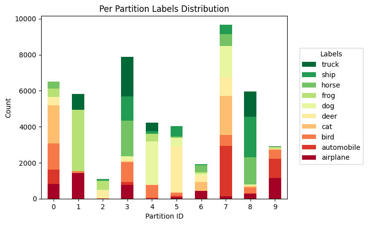

# Module 2 — Non-IID Data & Dirichlet Partitioning

This module explains why client data in federated learning is rarely IID and how non-IID data impacts FedAvg training.

**Notebook:** `2_IID_Concepts/Non_iid.ipynb`  
**Where to run:** ODU HPC (Wahab via Open OnDemand).

---
## Learning objectives

By the end of this module, students should be able to:
1. Define IID vs non-IID data in the federated learning setting.
2. Describe common types of client heterogeneity (label skew, covariate shift, quantity skew, drift).
3. Explain Dirichlet partitioning and how the concentration parameter controls skew.
4. Visualize client label distributions and interpret what they imply for training.
5. Observe and explain how increasing non-IID severity affects FedAvg convergence and final accuracy.

---
## Motivation

In real federated learning systems, clients hold data from different environments (users, devices, hospitals, regions, or corporations).  
As a result, local client distributions often differ from the global distribution.[2][17]

This notebook simulates non-IID data so students can observe:
- slower convergence,
- degraded global accuracy,
- higher variance across rounds,
- and “client drift” behavior during aggregation.

---

## IID vs Non-IID: definitions & types of heterogeneity

### IID (Independent & Identically Distributed)
All clients sample from the same joint distribution \(P(x, y)\).  
Each client dataset is an unbiased random subset of the global dataset.

### Non-IID
Client-specific distributions differ.[2] Common sources of heterogeneity include:
1. **Label distribution skew:** clients have different proportions of classes.
2. **Covariate shift:** for the same label, feature distributions differ across clients.
3. **Concept shift / drift:** \(P(y \mid x)\) varies by client or changes over time.
4. **Quantity skew:** clients have different dataset sizes.
5. **Temporal drift / nonstationarity:** distributions shift over time.

**In this module:** we focus on **label distribution skew**.

[Flower Distribution Tutorial](https://flower.ai/docs/datasets/tutorial-visualize-label-distribution.html)

---

## Dirichlet partitioning: intuition & procedure

### Intuition
Dirichlet partitioning gives a tunable way to assign class proportions across clients.[13][18]

- **Small \(\alpha\)** → strongly skewed client label mixtures (clients “specialize”)
- **Large \(\alpha\)** → more uniform mixtures (closer to IID)

### Procedure (label-skew)
Let:
- \(K\) = number of classes  
- \(N\) = number of clients  
- \(\alpha > 0\) = Dirichlet concentration parameter

For each class \(k \in \{1,\dots,K\}\):
1. Sample a probability vector across clients  
   \[
   \mathbf{p}_k = (p_{k,1}, \dots, p_{k,N}) \sim \text{Dirichlet}(\alpha \cdot \mathbf{1})
   \]
 reminder: \(\sum_i p_{k,i} = 1\)

2. Allocate approximately \(p_{k,i}\cdot n_k\) samples of class \(k\) to client \(i\)

3. Enforce basic constraints (e.g., minimum samples per client) if needed

This produces realistic non-IID label distributions while letting you control severity using \(\alpha\).

---

## Role of \(\alpha\): degree of heterogeneity

As a rule of thumb[13]:
- \(\alpha \to 0\): extreme heterogeneity (high skew)
- \(\alpha \approx 1\): moderate heterogeneity
- \(\alpha \gg 1\): approaches IID

**Notebook note:** if the notebook exposes a convenience knob (e.g., `non_iid_per`), document how it maps to \(\alpha\) in your implementation.

---

## Expected effects of non-IID on federated training

When heterogeneity increases, students should expect [14] [15] [16]:
- **Client drift / conflicting updates:** local updates move in different directions
- **Slower convergence:** more rounds needed to reach a given accuracy
- **Lower final accuracy:** the global model may underperform compared to IID
- **Uneven learning:** some clients improve quickly while others stagnate

---

## Relation to the notebook (what students will do)

In `Non_iid.ipynb`, students will:

1. Create IID and Dirichlet-based non-IID partitions across clients  
2. Vary \(\alpha\) (or the notebook’s non-IID knob) to change skew severity  
3. Visualize per-client label distributions (histograms/heatmaps)  
4. Run FedAvg training under multiple partition settings  
5. Compare global metrics across rounds (accuracy/loss) and discuss where/why performance degrades

---

## Suggested experiments

Run at least two comparisons:

1. **IID vs non-IID:** compare convergence curves and final accuracy  
2. **Sweep \(\alpha\):** try \(\alpha \in \{0.01, 0.1, 1.0, 10\}\) and compare distributions + results  
3. **Client participation:** keep \(\alpha\) fixed and vary the fraction of clients per round  
4. **Local epochs:** increase local epochs and observe whether drift becomes worse in non-IID settings

---

## Mitigation strategies (preview)

Non-IID performance issues motivate methods such as:
- FedProx (proximal regularization)[15]
- SCAFFOLD (control variates)[14]
<!-- - dynamic regularization approaches (e.g., FedDyn)
- personalization / clustering strategies -->

These are explored more directly in later modules.
---

## References

## References

[1] McMahan et al. *Communication-Efficient Learning of Deep Networks from Decentralized Data* (AISTATS 2017). https://proceedings.mlr.press/v54/mcmahan17a.html  
[2] Kairouz et al. *Advances and Open Problems in Federated Learning* (arXiv:1912.04977). https://arxiv.org/abs/1912.04977  
[3] Bonawitz et al. *Practical Secure Aggregation for Privacy-Preserving Machine Learning* (ePrint 2017/281). https://eprint.iacr.org/2017/281  
[4] Rieke et al. *The future of digital health with federated learning* (npj Digital Medicine, 2020). https://doi.org/10.1038/s41746-020-00323-1  
[5] Hard et al. *Federated Learning for Mobile Keyboard Prediction* (arXiv:1811.03604). https://arxiv.org/abs/1811.03604  
[6] Zheng et al. *Federated Meta-Learning for Fraudulent Credit Card Detection* (IJCAI 2020). https://doi.org/10.24963/ijcai.2020/642  
[7] GDPR (EUR-Lex). *Regulation (EU) 2016/679* (GDPR) — Article 44 “General principle for transfers”. https://eur-lex.europa.eu/eli/reg/2016/679/oj/eng  
[8] California DOJ. *California Consumer Privacy Act (CCPA)* overview. https://oag.ca.gov/privacy/ccpa  
[9] U.S. HHS. *The HIPAA Privacy Rule* overview. https://www.hhs.gov/hipaa/for-professionals/privacy/index.html  
[10] U.S. FTC. *How to Comply with the Privacy of Consumer Financial Information Rule (GLBA)*. https://www.ftc.gov/tips-advice/business-center/guidance/how-comply-privacy-consumer-financial-information-rule-gramm  
[11] Pew Research Center. *Americans and Privacy: Concerned, Confused and Feeling Lack of Control Over Their Personal Information* (2019). https://www.pewresearch.org/internet/2019/11/15/americans-and-privacy-concerned-confused-and-feeling-lack-of-control-over-their-personal-information/  
[12] IETF Internet-Draft. *Definition of End-to-end Encryption* (draft-knodel-e2ee-definition). https://datatracker.ietf.org/doc/html/draft-knodel-e2ee-definition-11  

[13] Flower Datasets. *DirichletPartitioner (alpha-controlled label skew partitioning)*. https://flower.ai/docs/datasets/ref-api/flwr_datasets.partitioner.DirichletPartitioner.html  
[14] Karimireddy et al. *SCAFFOLD: Stochastic Controlled Averaging for Federated Learning* (ICML 2020). https://proceedings.mlr.press/v119/karimireddy20a.html  
[15] Li et al. *Federated Optimization in Heterogeneous Networks (FedProx)* (MLSys 2020). https://proceedings.mlsys.org/paper_files/paper/2020/hash/1f5fe83998a09396ebe6477d9475ba0c-Abstract.html  
[16] Zhao et al. *Federated Learning with Non-IID Data* (arXiv:1806.00582, 2018). https://arxiv.org/abs/1806.00582  
[17] Li et al. *Federated Learning on Non-IID Data Silos: An Experimental Study* (ICDE 2022). https://doi.org/10.1109/ICDE53745.2022.00077  
[18] Yurochkin et al. *Bayesian Nonparametric Federated Learning of Neural Networks* (arXiv:1905.12022, 2019). https://arxiv.org/abs/1905.12022  

